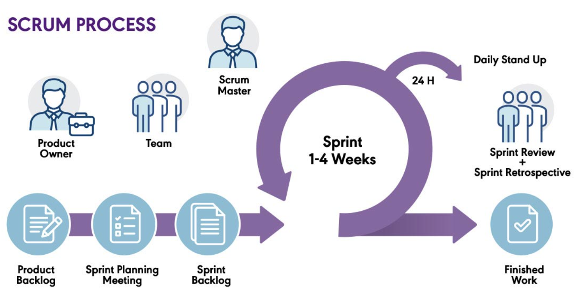
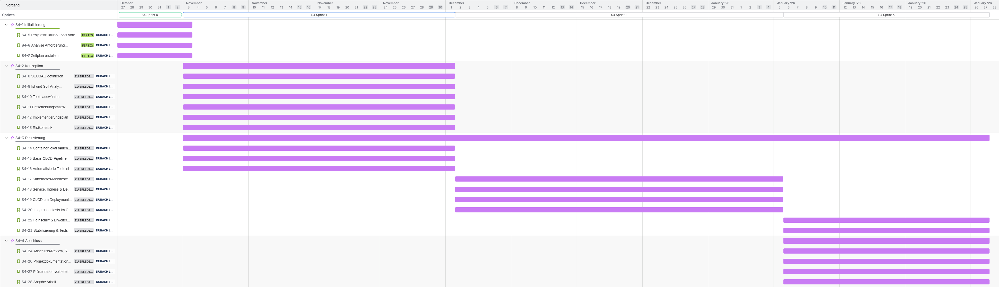
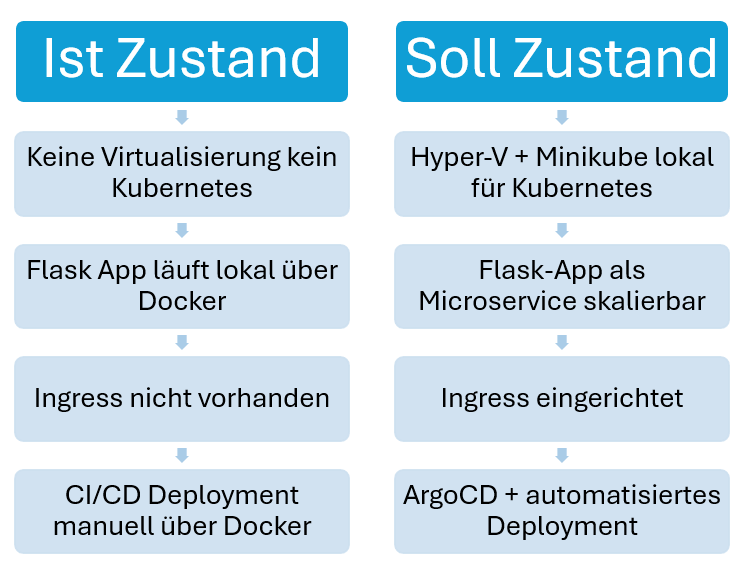
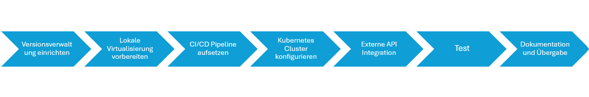
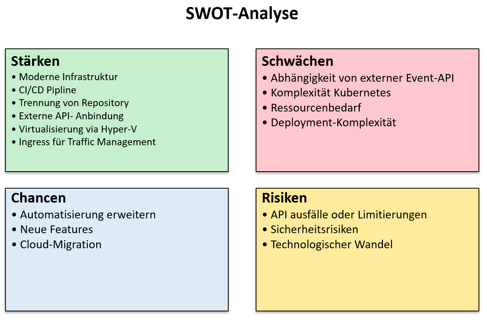

# Teil 2 Konzeption

Nun gehen wir ins Thema Konzeption über. In diesem Kapitel wird das ganze Projekt vorbereitet. Die Ausgangslage und Anforderungen werden beschrieben, auch was das Ziel des Projektes ist, wird aufgezeigt. Die Planung wird gemacht und es werden Entscheidungen getroffen um das Projekt mit den Optimalen Tools umzusetzten.

- [Teil 2 Konzeption](#teil-2-konzeption)
- [Informieren](#informieren)
  - [Was ist SCRUM?](#was-ist-scrum)
    - [Die wichtigsten Merkmale](#die-wichtigsten-merkmale)
    - [Die zentralen Rollen](#die-zentralen-rollen)
    - [Die wichtigsten Ereignisse (Events)](#die-wichtigsten-ereignisse-events)
    - [Zentrale Artefakte](#zentrale-artefakte)
    - [Wieso SCRUM](#wieso-scrum)
  - [Ausgangslage \& Motivation](#ausgangslage--motivation)
  - [Anforderungen erheben](#anforderungen-erheben)
    - [Funktionale Anforderungen](#funktionale-anforderungen)
    - [Nicht-funktionale Anforderungen](#nicht-funktionale-anforderungen)
  - [Relevanz und Nutzen eines Event-Finders](#relevanz-und-nutzen-eines-event-finders)
    - [Die Arbeit zeigt konkret, wie ein realer Microservice:](#die-arbeit-zeigt-konkret-wie-ein-realer-microservice)
    - [Dies bringt Vorteile für:](#dies-bringt-vorteile-für)
  - [Seusag](#seusag)
    - [Included – Bestandteil des Systems](#included--bestandteil-des-systems)
    - [Components – Infrastrukturkomponenten](#components--infrastrukturkomponenten)
    - [External – Externe Systeme](#external--externe-systeme)
    - [Excluded – Nicht im Projektumfang enthalten](#excluded--nicht-im-projektumfang-enthalten)
- [Planen](#planen)
  - [Zeitplan](#zeitplan)
  - [Meilensteine](#meilensteine)
    - [1. Initialisierung](#1-initialisierung)
    - [2. Konzeption](#2-konzeption)
    - [3. Realisieren](#3-realisieren)
    - [4. Abschluss](#4-abschluss)
  - [Ist und Soll](#ist-und-soll)
    - [Ist Zustand](#ist-zustand)
    - [Soll Zustand](#soll-zustand)
  - [Risikomatrix](#risikomatrix)
  - [Implementierungsplan](#implementierungsplan)
- [Entscheiden](#entscheiden)
  - [SWOT-Analyse](#swot-analyse)
  - [Technologieentscheidungen](#technologieentscheidungen)
    - [Minikube](#minikube)
    - [Docker-Kubernetes](#docker-kubernetes)
    - [Minikube vs Docker Desktop Kubernetes](#minikube-vs-docker-desktop-kubernetes)
    - [Virtualisierungs-Treiber auswählen:](#virtualisierungs-treiber-auswählen)
    - [Fazit](#fazit)
    - [Entscheidungsmatrix](#entscheidungsmatrix)
      - [Minikube vs Docker Desktop Kubernetes](#minikube-vs-docker-desktop-kubernetes-1)
      - [Hyper-V vs Docker Desktop](#hyper-v-vs-docker-desktop)
      - [Gesamt-Entscheidungsmatrix](#gesamt-entscheidungsmatrix)
      - [Fazit der Entscheidungsmatrix](#fazit-der-entscheidungsmatrix)
      - [Entscheidung](#entscheidung)

# Informieren

In diesem Kapitel werde ich alle Informationen zusammentragen, um das Projekt umsetzen zu können.

## Was ist SCRUM?

SCRUM ist ein agiles Rahmenwerk (Framework) für Projektmanagement, das vor allem in der Softwareentwicklung eingesetzt wird. Es hilft Teams, komplexe Projekte schrittweise zu bearbeiten und regelmäßig Ergebnisse zu liefern.

### Die wichtigsten Merkmale

- Die Arbeit wird in festen Zeitabschnitten, sogenannten Sprints (meist 2–4 Wochen), erledigt.
- Transparenz, Überprüfung und Anpassung: Nach jedem Sprint wird das Ergebnis vorgestellt und gegebenenfalls der Plan angepasst.

### Die zentralen Rollen

- Product Owner – Verantwortlich für das Produkt und dessen Anforderungen (Pflege des Product Backlogs).
- Scrum Master – Unterstützt das Team, entfernt Hindernisse und sorgt für die Einhaltung von SCRUM.
- Entwicklungsteam – Umsetzt die Anforderungen und liefert am Ende eines Sprints ein fertiges Produktinkrement.

### Die wichtigsten Ereignisse (Events)

- Sprint Planning – Planung, was im kommenden Sprint erreicht werden soll.
- Daily Scrum – Tägliches 15-Minuten-Meeting zur Abstimmung.
- Sprint Review – Vorstellung der Ergebnisse am Sprintende.
- Sprint Retrospective – Rückblick auf den Sprint zur Prozessverbesserung.

### Zentrale Artefakte

- Product Backlog – Liste aller Anforderungen an das Produkt.
- Sprint Backlog – Auswahl der Aufgaben für den aktuellen Sprint.
- Increment – Das am Ende eines Sprints fertige und getestete Produktstück.

> (Chat GPT) [Quelle](https://chatgpt.com/share/6818f168-0354-800e-8c00-119b2ed7c509)

### Wieso SCRUM

Ich habe mich bewusst für SCRUM als Vorgehensmodell entschieden, weil es ein etabliertes, agiles Framework ist. SCRUM ermöglicht es, in kurzen Zyklen (Sprints) kontinuierlich, funktionsfähige Ergebnisse zu liefern, die regelmäßig überprüft und angepasst werden können.

Durch die klare Struktur, regelmäßigen Events (Sprint Planning, Sprint Review, Retrospektive) und einem fokussierten Backlog-Management entsteht ein hohes Maß an Transparenz, Planbarkeit und Flexibilität.

Ein weiterer, entscheidender Vorteil von SCRUM ist, die enge Einbindung von Feedback. So kann frühzeitig auf Veränderungen oder neue Erkenntnisse reagiert werden, ohne die gesamte Projektplanung überarbeiten zu müssen. Dies fördert eine nutzerzentrierte Entwicklung und reduziert das Risiko, am Bedarf vorbei zu arbeiten.

Zusätzlich haben wir im Unterricht SCRUM in der Theorie angeschaut und nun kann ich es im Praktischen lernen umzusetzten. Natürlich wird einiges am Standard Prozess angepasst, da ich das Projekt alleine durchführe. Hier ist zum Beispiel ein Daily SCRUM nicht notwendig.

> (Chat GPT) [Quelle](https://chatgpt.com/share/68230b9b-2d9c-800e-a1eb-64bd9fe8ed96)

## Ausgangslage & Motivation

Mit der zunehmenden Verbreitung von Cloud-Technologien, Microservice-Architekturen und DevOps-Methoden wächst der Bedarf an skalierbaren, automatisierten und flexibel wartbaren Systemen.
Unternehmen stehen vor der Herausforderung, Software schnell, zuverlässig und reproduzierbar bereitzustellen — insbesondere in dynamischen Umgebungen wie Kubernetes-Clustern.

Der Music Eventfinder-Microservice dient in dieser Arbeit als praxisnahes Beispiel, um den vollständigen Lebenszyklus eines Cloud-basierten Microservice-Systems zu realisieren.
Im Fokus steht nicht die fachliche Weiterentwicklung der Anwendung, sondern der Aufbau einer modernen, automatisierten Bereitstellungs- und Betriebsumgebung auf Basis von:

- Containerisierung
- Continuous Integration und Continuous Deployment (CI/CD)
- Kubernetes-Orchestrierung
- Agiler Projektsteuerung nach Scrum

Die persönliche Motivation liegt im Interesse an Cloud-nativem Deployment, moderner Softwarebereitstellung und dem praxisnahen Einsatz von DevOps-Werkzeugen und Kubernetes-Infrastruktur.

## Anforderungen erheben

Für die erfolgreiche Umsetzung des Projektes werden sowohl funktionale als auch technische/non-funktionale Anforderungen definiert.

### Funktionale Anforderungen

- Bereitstellung des bestehenden Music Eventfinder-Microservices in Containern
- Externe Event-API-Anbindung bleibt funktional
- Bereitstellung einer REST-API für Eventdaten
- Zugriff auf Nutzer-/Einstellungsdaten über Datenbank

### Nicht-funktionale Anforderungen

- Automatisierter Build-, Test- und Deployment-Prozess (CI/CD)
- Containerisierung mit Docker zur Portabilität
- Deployment in einem Kubernetes-Cluster
- Verwaltung von Konfiguration und Secrets
- Nachvollziehbare Versionierung & Dokumentation

## Relevanz und Nutzen eines Event-Finders

### Die Arbeit zeigt konkret, wie ein realer Microservice:

- automatisiert entwickelt, gebaut, getestet und deployt wird
- in einer Kubernetes-Umgebung betrieben und skaliert werden kann

### Dies bringt Vorteile für:

**Entwickler/innen & Studierende**

- Hands-on-Erfahrung mit Kubernetes & DevOps-Pipelines
- Praxiswissen zu Container-Workflows & Cloud-Infrastruktur

**Unternehmen / Plattformbetreiber**

- Vorlage für automatisierte Softwarebereitstellung
- Erweiterbare Microservice-Struktur
- Basis für skalierbare, cloud-native Anwendungen

**Endnutzer/innen**

- Zugriff auf personalisierte Musik-Eventdaten über einen stabilen, skalierbaren Service

Durch den Einsatz moderner Kubernetes und DevOps-Technologien entsteht eine zukunftsfähige, skalierbare und wartungsfreundliche Lösung, die reale Anforderungen an moderne Softwarebereitstellung abbildet.

> (Chat GPT) [Quelle](https://chatgpt.com/share/6908ec06-4a2c-8007-834a-6013e399ba13)

## Seusag

Das nachfolgende Diagramm zeigt die Systemgrenzen des Projekts Automatisierte Bereitstellung des Microservices „Music Eventfinder“ mittels CI/CD-Pipeline auf Kubernetes.
Es visualisiert, welche Komponenten Teil des Systems (Included) sind, welche Infrastrukturabhängigkeiten (Components) bestehen, welche externen Systeme (External) angebunden sind, und welche Aspekte bewusst ausgeschlossen (Excluded) wurden.

### Included – Bestandteil des Systems

**Visualisierung:**
Die Architektur des Systems wird über ein grafisches Diagramm dargestellt, das die Beziehungen zwischen Repositories, Container-Registry, Kubernetes-Komponenten und externen APIs visualisiert. Dies unterstützt das Verständnis des Deployments und der Interaktionen der Microservices.

**Versionsverwaltung:**
Die Versionsverwaltung erfolgt über GitHub. Hier liegen sowohl der Quellcode der Applikation (App Repository) als auch die Deployment-Manifeste (Config Repository). Über CI/CD-Pipelines werden Änderungen automatisch getestet, gebaut und in die Container Registry gepusht.

**Kubernetes Cluster:**
Das System läuft auf einem lokalen Kubernetes-Cluster, das über Minikube auf Hyper-V bereitgestellt wird. Kubernetes orchestriert die Deployment-Objekte, verwaltet Container, skaliert Services bei Bedarf und sorgt für Ausfallsicherheit.

### Components – Infrastrukturkomponenten

**HyperV:**
Hyper-V dient als Virtualisierungslösung, auf der Minikube läuft. Dadurch wird eine isolierte und kontrollierte Laufzeitumgebung für das Kubernetes-Cluster bereitgestellt, ohne dass externe Cloud-Ressourcen benötigt werden.

**Ingress:**
Ingress übernimmt das Routing des eingehenden Traffics innerhalb des Kubernetes-Clusters. Es sorgt dafür, dass Anfragen korrekt an die Musiceventfinder-App weitergeleitet werden, inklusive URL-basiertem Routing und eventueller TLS-Konfigurationen.

**Microservice:**
Der Musiceventfinder ist der zentrale Microservice des Projekts. Er greift auf externe APIs (z. B. Ticketmaster) zu, verarbeitet die Eventdaten und stellt sie der Applikation für die Anzeige bereit. Er wird über Kubernetes und ArgoCD deployt und ist skalierbar.

**ArgoCD:**
ArgoCD fungiert als GitOps-Controller. Es überwacht die Konfigurations-Repositories, zieht automatisch die aktuellsten Deployment-Manifeste und synchronisiert diese mit dem Cluster. So wird ein kontinuierliches, versionskontrolliertes Deployment gewährleistet.

**App Repository:**
Das App Repository in GitHub enthält den Quellcode der Musiceventfinder-Applikation inklusive aller notwendigen CI/CD-Pipelines. Änderungen hier lösen automatisch Build- und Deployment-Prozesse aus.

**Config Repository:**
Im Config Repository werden alle Kubernetes-Manifeste abgelegt, die das Deployment der Applikation beschreiben (z. B. Deployment, Service, Ingress). ArgoCD verwendet dieses Repository als Quelle für das Cluster-Deployment.

**Container Registry:**
Die Container Registry speichert die gebauten Docker-Images der Applikation. Die CI-Pipeline aktualisiert bei jeder Änderung die Images, und ArgoCD deployt diese in das Kubernetes-Cluster.

### External – Externe Systeme

**Ticketmaster API:**
Die Musiceventfinder-App greift auf die Ticketmaster API zu, um aktuelle Eventdaten abzurufen. Diese Integration ermöglicht es, Nutzern eine aktuelle und umfangreiche Übersicht von Musikveranstaltungen zu bieten, ohne dass die Daten selbst gepflegt werden müssen.

### Excluded – Nicht im Projektumfang enthalten

**Echtzeitverarbeitung:**
Die Eventdaten werden nicht in Echtzeit gestreamt oder aktualisiert. Es findet keine kontinuierliche Datenverarbeitung statt.

**Rechtekonzept:**
Das System implementiert keine differenzierten Benutzerrollen oder Berechtigungsstufen. Basis-Authentifizierung ist vorhanden, aber keine fein granulierte Zugriffskontrolle.

**Analytics & Monitoring:**
Es erfolgt keine systemweite Auswertung von Nutzungsstatistiken oder Performance-Kennzahlen. Monitoring-Tools wie Prometheus oder Grafana sind nicht integriert.

**Support:**
Ein Benutzer-Support (z. B. Ticketsystem oder Chat-Support) wurde nicht umgesetzt, da es sich um einen Prototypen handelt.

**Eigenentwicklung von Eventdaten:**
Das System erstellt oder verwaltet keine eigenen Events. Es konsumiert ausschließlich Informationen aus externen APIs.

**Cloud Deployment:**
Das System wird nicht in einer öffentlichen Cloud (z. B. AWS, Azure, GCP) betrieben. Stattdessen erfolgt das Deployment vollständig lokal auf Hyper-V/Minikube. Dies aus kostengründen.

> (Chat GPT) [Quelle](https://chatgpt.com/share/69145d5b-1d28-8007-a9ab-019f02a428de)

# Planen

Hier werde ich das ganze Projekt planen. Es wird ein Zeitplan erstellt, wann welche Tätigkeiten fällig sind und die Meilensteine sind genau beschrieben.

## Zeitplan

## Meilensteine
### 1. Initialisierung

In der Initialisierungsphase wird das Projekt offiziell gestartet. Ziel ist es, eine klare Projektgrundlage zu schaffen. Dazu gehören die Definition von Zielen, die Identifikation von Stakeholdern, die grobe Planung sowie die Erstellung eines Projektauftrags. Risiken und Chancen werden frühzeitig analysiert und es wird geprüft, ob das Projekt wirtschaftlich und realistisch durchführbar ist.

### 2. Konzeption

In dieser Phase wird das Projekt inhaltlich konkretisiert. Anforderungen werden detailliert erhoben und dokumentiert (z. B. als User Stories), Lösungsansätze erarbeitet und bewertet. Es entsteht ein Fach- und ggf. ein technisches Konzept, das die Grundlage für die spätere Umsetzung bildet.

### 3. Realisieren

Jetzt beginnt die eigentliche Umsetzung: Entwicklung, Konfiguration, Tests und Integration der Komponenten. Die Arbeit erfolgt meist iterativ (z. B. in Sprints), um regelmäßig funktionierende Zwischenstände zu liefern.

### 4. Abschluss

Das Projekt wird formal beendet. Es finden eine Abnahme, eine Übergabe an den Betrieb sowie ggf. eine Schulung der Nutzer statt. Ausserdem werden Lessons Learned dokumentiert, um aus dem Projekt für zukünftige Vorhaben zu lernen.

## Ist und Soll

### Ist Zustand

Derzeit läuft die Flask-App lokal in einem Docker-Container. Es existiert noch keine Kubernetes-Umgebung und keine automatisierte Deployment-Pipeline. Hyper-V und Minikube sind nicht eingerichtet, Ingress für Routing ist noch nicht vorhanden, und ArgoCD wurde noch nicht integriert.

### Soll Zustand

Ziel ist die Umsetzung einer modularen Microservice-Architektur, in der die Flask-App containerisiert läuft und lokal auf einem Minikube-Kubernetes-Cluster betrieben wird. Hyper-V stellt die Virtualisierung bereit, Ingress sorgt für sauberes Routing, und ArgoCD automatisiert die Deployments. Externe APIs wie Ticketmaster werden zuverlässig eingebunden, und die Versionsverwaltung erfolgt sauber getrennt zwischen App- und Config-Repositories. Die Architektur soll skalierbar, wartbar und erweiterbar sein, um künftige Microservices problemlos integrieren zu können.

> (Chat GPT) [Quelle](https://chatgpt.com/share/691c5c94-df1c-8007-92fd-93219b75bf52)

## Risikomatrix

Wahrscheinlichkeit (W):
1 = niedrig
2 = mittel
3 = hoch

Auswirkung (A):
1 = gering
2 = mittel
3 = hoch
4 = sehr hoch

Risikoscore: W × A

| Score | Kategorie |
| ----- | ----------|
| 1–3   | Niedrig   |
| 4–6   | Mittel    |
| 7–9   | Hoch      |
| 10–12 | Sehr hoch |

| Risiko | Beschreibung | W | A | Score | Kategorie | Gegenmaßnahmen |
| ------ | ------------ | - | - | ----- | --------- | -------------- |
| **Hyper-V Ressourcenengpass** | VM benötigt mehr CPU/RAM als geplant, Cluster wird instabil | 2 | 3 | 6 | Mittel | Ressourcenplanung, Limits setzen, Monitoring |
| **Kubernetes Instabilität** | Fehlerhafte Deployments, CrashLoopBackoffs durch falsche Manifeste | 2 | 3 | 6 | Mittel | Tests lokal, Liveness/Readiness Probes, ArgoCD Sync-Prüfung |
| **ArgoCD Fehlkonfiguration** | Fehlendes Sync- oder Health-Monitoring führt zu fehlerhaften Releases | 2 | 3 | 6 | Mittel | ArgoCD Policies, automatische Health-Checks |
| **Externe Ticketmaster-API nicht erreichbar** | API Down, Rate Limit, Timeout → Microservice liefert keine Daten | 3 | 4 | 12 | Sehr hoch | Caching, Retry-Mechanismen, Circuit Breaker, Fehlermeldungen |
| **Ingress Routing Fehler** | Zugriff auf App nicht möglich durch falsche Regeln | 2 | 2 | 4 | Mittel | Ingress-Tests, Logs prüfen, standardisierte Routen |
| **Container Build-Fehler** | Image baut nicht oder enthält Bugs | 2 | 2 | 4 | Mittel | CI-Tests, Linting, Build-Pipeline automatisieren |
| **Versionskonflikte/Dependency Bugs** | Bibliotheken oder Images inkompatibel | 1 | 2 | 2 | Niedrig | Versionsmanagement, Lockfiles |
| **Netzwerkfehler im Cluster** | Services nicht erreichbar oder DNS bricht | 1 | 3 | 3 | Niedrig/Mittel | CoreDNS-Monitoring, kubectl describe/logs prüfen |
| **Repo-Strukturfehler (App/Config)** | ArgoCD kann Manifeste nicht finden oder falsch anwenden | 1 | 2 | 2 | Niedrig | Klare Repo-Struktur (App Repo / Config Repo) |

> (Chat GPT) [Quelle](https://chatgpt.com/share/691c4eab-5f0c-8007-8817-4b7039fabc74)

## Implementierungsplan

Hier wird grob dargestellt, wie in diesem Projekt vorgegangen wird.

Der Implementierungsplan für den Music Event Finder Microservice gliedert sich in mehrere aufeinander aufbauende Schritte, die für die erfolgreiche Umsetzung des Projekts notwendig sind. Jeder Schritt ist essenziell, da er die Grundlage für den nächsten bildet. Durch diese strukturierte Vorgehensweise wird sichergestellt, dass das System nicht nur funktionsfähig ist, sondern auch sicher, wartbar und erweiterbar bleibt. Kein Schritt kann ausgelassen werden, da nur das Zusammenspiel aller Maßnahmen die gewünschte Qualität und Zuverlässigkeit des Gesamtsystems gewährleistet.

> (Chat GPT) [Quelle](https://chatgpt.com/share/691c632c-1b80-8007-9f6a-b2ee70f95a04)

# Entscheiden

Im Kapitel Entscheiden werden die Produkte die zur Auswahl stehen verglichen. Es gibt eine SWOT Analyse und eine Entscheidunsmatrix. Zusätzlich wird beschrieben, wieso ich mit den Ausgewählten Programmen und Tools arbeite.

## SWOT-Analyse

Die folgende SWOT-Analyse fasst die wesentlichen Einflussfaktoren zusammen:

## Technologieentscheidungen

### Minikube

Nutze Minikube, wenn du:

* Kubernetes standardkonform ausprobieren willst
* lokale Entwicklung/Tests machst
* das Verhalten eines echten Clusters möglichst genau simulieren möchtest
* Add-ons (Ingress, Dashboard, Metrics-Server etc.) benötigst
* verschiedene Container-Runtimes testen möchtest (Docker, CRI-O, containerd)

Minikube ist der übliche Standard für lokale Kubernetes-Umgebungen.

### Docker-Kubernetes

Nutze Docker Kubernetes, wenn:

* du bereits Docker Desktop nutzt und schnell testen willst
* es dir um eine superschnelle, einfache Installation geht
* du keine komplexen Cluster-Features brauchst

### Minikube vs Docker Desktop Kubernetes

| Merkmal | Minikube | Docker Desktop K8s |
| ------- | -------- | ------------------ |
| Echtheit des Kubernetes-Verhaltens sehr hoch | begrenzt | |
| Add-ons / Erweiterbarkeit viele Optionen | eingeschränkt | |
| Performance | gut, aber VM nötig | sehr gut (native Docker-Engine) |
| Einrichtung | etwas mehr Aufwand | extrem einfach |
| Lernfaktor für echtes K8s hoch | begrenzt | |

### Virtualisierungs-Treiber auswählen: 

**Hyper-V vs Docker Desktop – Minikube auf Windows**

| Feature / Kriterium | Hyper-V | Docker Desktop | Kommentar |
|---------------------|---------|----------------|-----------|
| **Integration** | Direkt in Windows integriert | Läuft auf Windows über eigene VM | Hyper-V stabiler, weniger Abhängigkeiten |
| **Installation / Setup** | Einmaliger Setup-Aufwand für Switch | Sehr einfach, nur Docker Desktop installieren | Hyper-V Setup lohnt sich langfristig für Multi-Node & Tests |
| **Ressourcenkontrolle** | CPU, RAM, Storage pro VM exakt konfigurierbar | Limitierungen durch Docker Desktop Einstellungen | Bessere Performance-Kontrolle für Tests |
| **Isolation** | Voll isolierte VM | Docker-Container teilen Host-Kernel | Hyper-V sicherer, weniger System-Risiko |
| **Multi-Node Cluster** | Einfach weitere VMs hinzufügen | Komplex / limitiert | Hyper-V realistischere Cluster-Simulation |
| **Netzwerkoptionen** | NAT, extern, intern, flexibel | Begrenzte Netzwerkeinstellungen | Hyper-V besser für fortgeschrittene Szenarien |
| **Snapshots / Backups** | Snapshots direkt möglich | Nur über Docker Desktop-Export | Hyper-V erlaubt gefahrloses Experimentieren |
| **Geschwindigkeit (Startup)** | VM startet etwas langsamer | Schnellere Container-Starts | Startup-Nachteil minimal, Vorteil langfristig |
| **Kubernetes Feature Support** | Vollständig | Eingeschränkt | Hyper-V näher am echten K8s |
| **Abhängigkeiten** | Keine Docker-Abhängigkeit | Docker muss laufen | Hyper-V unabhängig von Drittsoftware |
| **GUI / Dashboard** | Minikube Dashboard via Browser | Docker Desktop hat eigenes Dashboard | Docker leichter für Anfänger, Hyper-V trotzdem brauchbar |

### Fazit

- **Hyper-V gewinnt bei:** Stabilität, Flexibilität, Multi-Node, Isolation, Ressourcenmanagement → ideal für echtes Dev/Testing Cluster.  
- **Docker Desktop punktet bei:** Einfachheit, schnelle lokale Tests, minimale Einrichtung → gut für „schnell starten“.  

> (Chat GPT) [Quelle](https://chatgpt.com/share/690b5e67-32b4-8007-999a-8bbbb27517c1)

### Entscheidungsmatrix

#### Minikube vs Docker Desktop Kubernetes

| **Kriterium / Feature**            | **Minikube**                                        | **Docker Desktop Kubernetes**                |
| ---------------------------------- | --------------------------------------------------- | -------------------------------------------- |
| Echtheit des Kubernetes-Verhaltens | ✓ sehr hoch                                         | ~ begrenzt                                   |
| Add-ons / Erweiterbarkeit          | ✓ viele Optionen                                    | ✗ eingeschränkt                              |
| Performance                        | ~ gut, benötigt VM                                  | ✓ sehr gut (native Docker Engine)            |
| Einrichtung                        | ~ etwas Aufwand                                     | ✓ extrem einfach                             |
| Lernfaktor für echtes Kubernetes   | ✓ hoch                                              | ~ begrenzt                                   |
| Nutzungsszenario                   | Entwicklung, Tests, realistische Cluster-Simulation | Schnelle lokale Tests, minimaler Aufwand     |
| Flexibilität (Container-Runtime)   | ✓ Docker, CRI-O, containerd                         | ✗ nur Docker                                 |
| Abhängigkeiten                     | unabhängig von Docker Desktop                       | abhängig von Docker Desktop                  |
| **Empfehlung**                     | Für realistische Kubernetes-Workloads               | Für schnelle, einfache Demo-/Test-Umgebungen |

#### Hyper-V vs Docker Desktop

| **Feature / Kriterium**    | **Hyper-V (für Minikube)**                  | **Docker Desktop Backend**            |
| -------------------------- | ------------------------------------------- | ------------------------------------- |
| Integration in Windows     | ✓ direkt integriert                         | ~ eigene VM über Docker Desktop       |
| Installation / Setup       | ~ einmaliger Setup-Aufwand                  | ✓ sehr einfach                        |
| Ressourcenkontrolle        | ✓ exakte CPU/RAM/Storage-Zuweisung          | ~ begrenzt durch Docker-Einstellungen |
| Isolation                  | ✓ vollständige VM-Isolation                 | ✗ Container teilen Host-Kernel        |
| Multi-Node Cluster         | ✓ einfach und realistisch                   | ✗ kaum praktikabel                    |
| Netzwerkoptionen           | ✓ sehr flexibel (NAT, extern, intern)       | ✗ eingeschränkt                       |
| Snapshots / Backups        | ✓ Hyper-V Snapshots möglich                 | ✗ nur über Docker-Export              |
| Geschwindigkeit (Startup)  | ~ etwas langsamer                           | ✓ sehr schnell                        |
| Kubernetes Feature Support | ✓ vollständig                               | ~ eingeschränkt                       |
| Abhängigkeiten             | unabhängig von Docker                       | erfordert Docker Desktop              |
| GUI / Dashboard            | Minikube Dashboard                          | Docker Desktop Dashboard              |
| **Empfehlung**             | Für realistische Tests & Cluster-Simulation | Für einfache lokale Nutzung           |

#### Gesamt-Entscheidungsmatrix

| **Entscheidungsszenario**            | **Minikube** | **Docker K8s** | **Hyper-V** | **Docker Desktop** |
| ------------------------------------ | ------------ | -------------- | ----------- | ------------------ |
| Echtes Kubernetes-Feeling            | ✓            | ~              | ✓           | ~                 |
| Realistische Cluster-Simulation      | ✓            | ✗              | ✓           | ✗                |
| Multi-Node möglich                   | ✓            | ✗              | ✓           | ✗                |
| Einfache Installation                | ~            | ✓              | ~           | ✓                 |
| Add-ons nutzbar (Ingress, Metrics …) | ✓            | ~              | ✓           | ~                 |
| Ressourcen- & Performance-Kontrolle  | ~            | ✓              | ✓           | ~                 |
| Für Anfänger geeignet                | ~            | ✓              | ~           | ✓                 |
| Für langfristiges Dev/Testing        | ✓            | ✗              | ✓           | ✗                |
| Unabhängig von Docker Desktop        | ✓            | ✗              | ✓           | ✗                |
| Sicherheit / Isolation               | ✓            | ~              | ✓           | ✗                |

####  Fazit der Entscheidungsmatrix

**Beste Kombination für realistische Entwicklung**

**Minikube + Hyper-V**
Bietet hohe Stabilität, Flexibilität, Multi-Node-Support, Isolation und realistische Kubernetes-Funktionalität.

**Beste Kombination für schnelle und einfache Tests**

**Docker Desktop + Docker Kubernetes**
Minimaler Setup-Aufwand, ideal für schnelle lokale Tests, jedoch technisch weniger nah am echten Kubernetes.

#### Entscheidung
Da ich das Projekt so realistisch wie möglich umsetzten möchte, werde ich mich für die Variante Minikube + Hyper-V entscheiden.

> (Chat GPT) [Quelle][text](https://chatgpt.com/share/691c4131-e78c-8007-b99b-0448ad90d2e2)

> Back [Page](https://lauradubach.github.io/Semesterarbeit4/Sites/Teil%201%20Initialisierung.html)
>
> Next [Page](https://lauradubach.github.io/Semesterarbeit4/Sites/Teil%203%20Realisierung.html)