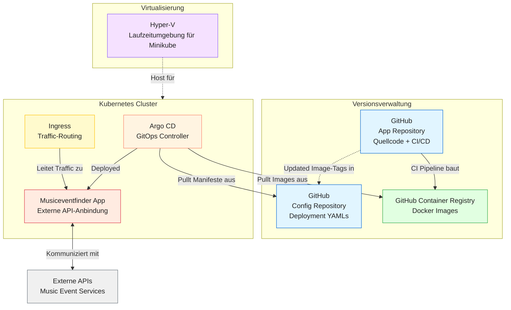

# Teil 3 Realisieren

Kommen wir zur Umsetzung des Projektes. In diesem Teil wird genau beschrieben, wie alles realisiert wurde und wie ich vorgegangen bin. Es wird getestet und geprüft, sodass ersichtlich ist, ob alles funktioniert wie es soll. Falls Probleme aufgetaucht sind, werden diese ebenfalls beschrieben, inklusive Lösungsweg.

- [Teil 3 Realisieren](#teil-3-realisieren)
- [Realisieren](#realisieren)
  - [Architekturdiagramm](#architekturdiagramm)
  - [So funktionierts](#so-funktionierts)
    - [Überblick](#überblick)
    - [Komponenten im Detail](#komponenten-im-detail)
      - [Zusammenspiel der Komponenten](#zusammenspiel-der-komponenten)
  - [Datenbank](#datenbank)
  - [API](#api)
  - [Github Secrets](#github-secrets)
  - [Entwicklung](#entwicklung)
  - [Aufgetretene Probleme](#aufgetretene-probleme)
  - [Fallbacksolution](#fallbacksolution)
- [Kontrollieren](#kontrollieren)
  - [Testing](#testing)
    - [Testkonzept](#testkonzept)
    - [Testdurchführung](#testdurchführung)
      - [Umgebung:](#umgebung)

# Realisieren

Nun wird die Realisierung beschrieben. Die Umsetzung der Arbeit wird gezeigt inklusive Bilder der Produktiven Umgebung.

## Architekturdiagramm

## So funktionierts

### Überblick

### Komponenten im Detail
 
#### Zusammenspiel der Komponenten

## Datenbank

## API

## Github Secrets

## Entwicklung

## Aufgetretene Probleme

## Fallbacksolution

Da das Projekt nicht für den Produktiven Gebrauch gedacht ist, weil es sich auf einem Learner LAB befindet, benötigt es keine Fallbacksolution. Falls etwas nicht klappt, kann das ganze einfach heruntergefahren werden und wieder auf der lokalen Umgebung bearbeitet werden.

# Kontrollieren

## Testing
### Testkonzept

| Testperson | Datum |
| ---------- | ----- |

| System | Testmittel | Testmethode |
| -------| ---------- | ----------- |

### Testdurchführung

| Testfall | Erwartetes Ergebnis | Testresultat |
| ---------| ------------------- | ------------ |

#### Umgebung:

> Back [Page](https://lauradubach.github.io/Semesterarbeit4/Sites/Teil%202%20Konzeption.html)
>
> Next [Page](https://lauradubach.github.io/Semesterarbeit4/Sites/Teil%204%20Abschluss.html)