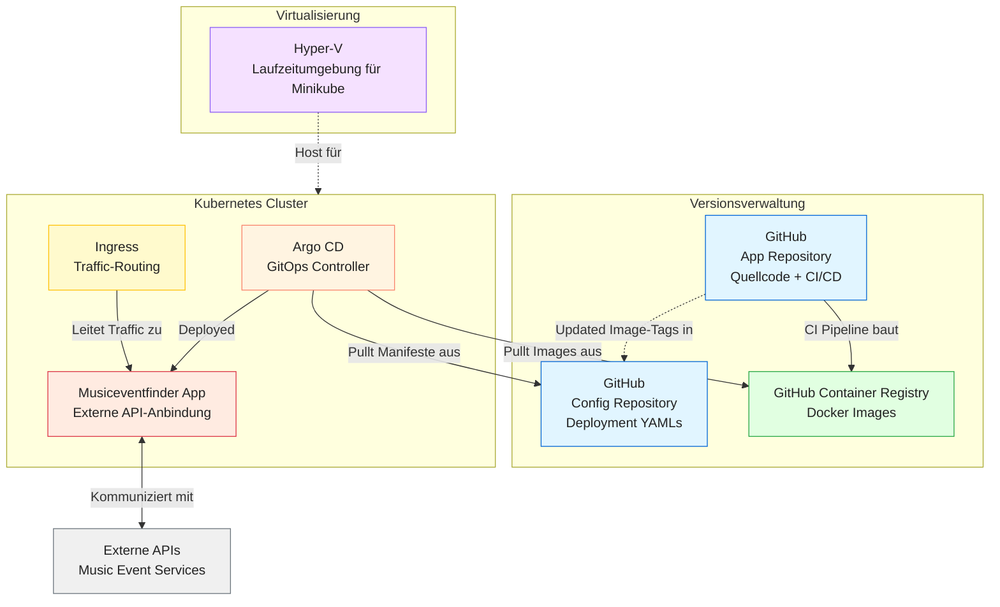
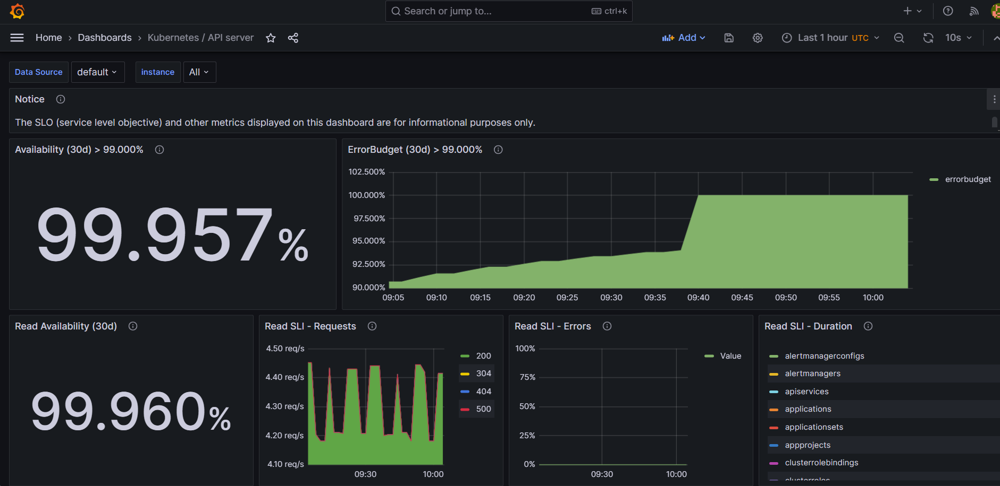
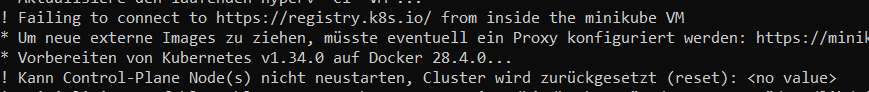
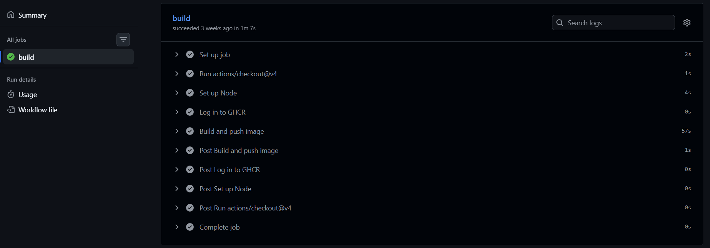
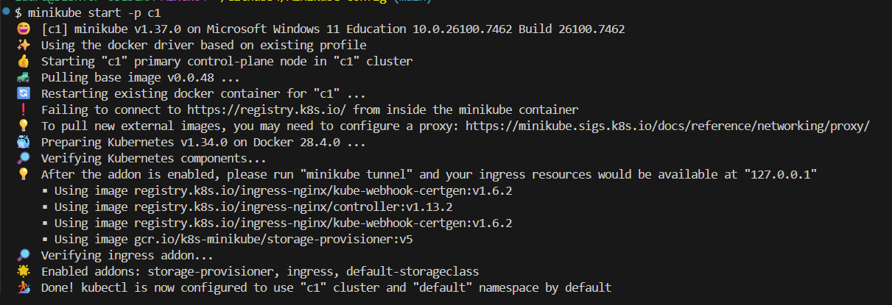
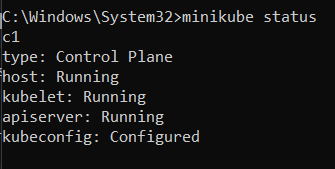
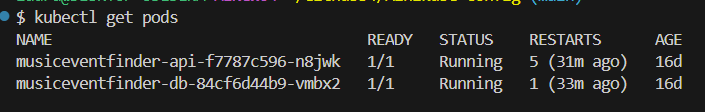
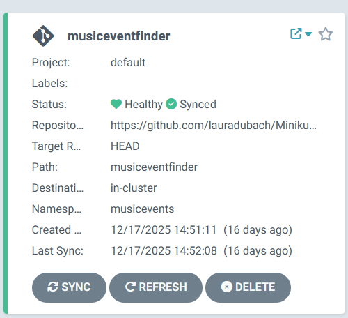
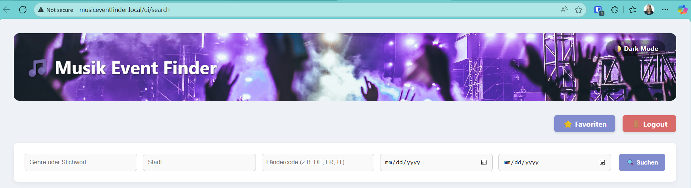
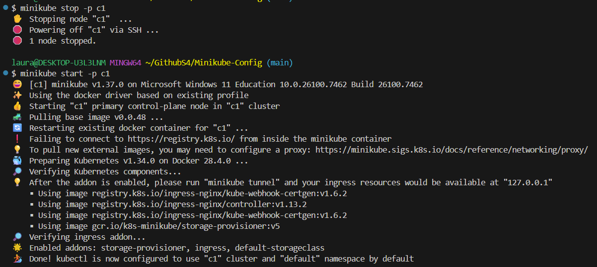

# Teil 3 Realisieren

Kommen wir zur Umsetzung des Projektes. In diesem Teil wird genau beschrieben, wie alles realisiert wurde und wie ich vorgegangen bin. Es wird getestet und geprüft, sodass ersichtlich ist, ob alles funktioniert wie es soll. Falls Probleme aufgetaucht sind, werden diese ebenfalls beschrieben, inklusive Lösungsweg.

- [Teil 3 Realisieren](#teil-3-realisieren)
- [Realisieren](#realisieren)
  - [Architekturdiagramm](#architekturdiagramm)
  - [So funktionierts](#so-funktionierts)
    - [Überblick](#überblick)
    - [Komponenten im Detail](#komponenten-im-detail)
      - [Zusammenspiel der Komponenten](#zusammenspiel-der-komponenten)
  - [Entwicklung](#entwicklung)
    - [Hilfreiche Kommandos](#hilfreiche-kommandos)
    - [Umsetzung](#umsetzung)
      - [ArgoCD einrichten](#argocd-einrichten)
        - [Konfiguration innerhalb von ArgoCD](#konfiguration-innerhalb-von-argocd)
      - [Secrets](#secrets)
    - [Automatisieren](#automatisieren)
    - [Monitoring](#monitoring)
  - [Aufgetretene Probleme](#aufgetretene-probleme)
  - [Wechsel von Hyper-V zu Docker als Minikube-Driver](#wechsel-von-hyper-v-zu-docker-als-minikube-driver)
  - [Fallbacksolution](#fallbacksolution)
- [Kontrollieren](#kontrollieren)
  - [Testing](#testing)
    - [Testkonzept](#testkonzept)
    - [Testdurchführung](#testdurchführung)

# Realisieren

Nun wird die Realisierung beschrieben. Die Umsetzung der Arbeit wird gezeigt inklusive Bilder der Produktiven Umgebung.

## Architekturdiagramm



## So funktionierts

### Überblick

Der Microservice Musiceventfinder ist in Flask (Python) implementiert und wird als Docker-Image in der GitHub Container Registry verwaltet. Die Anwendung wird über Argo CD in einem Kubernetes-Cluster (Minikube) deployed. Externe Music-Event-APIs liefern die Eventdaten. Für die lokale Entwicklung wird eine Hyper-V-Umgebung genutzt, während CI/CD-Pipelines die automatische Bereitstellung und Aktualisierung des Images sicherstellen.

### Komponenten im Detail

1. Backend (Flask + Python)
   
  - Implementiert eine REST-API zur:
    - Abfrage und Anzeige von Musik-Events über externe APIs.
    - Verwaltung von Favoriten oder Nutzerinteraktionen (CRUD).
  - Verarbeitet die API-Daten und stellt sie den Nutzern bereit.

2. Docker-Image (GitHub Container Registry)

  - Das fertige Image wird in GitHub abgelegt.
  - Enthält die gesamte Laufzeitumgebung der Flask-App.
  - Argo CD zieht dieses Image und deployed es in das Kubernetes-Cluster.

3. Kubernetes Cluster (Minikube)

  - Orchestriert die Container und sorgt für Skalierbarkeit sowie Ausfallsicherheit.
  - Argo CD überwacht die Manifeste im Config Repository und sorgt für ein automatisches Deployment der neuesten Images.
  - Ingress routet den Benutzer-Traffic zur Musiceventfinder App.

4. Externe Music-Event-APIs

  - Liefern aktuelle Veranstaltungsinformationen.
  - Das Backend ruft diese Daten ab, verarbeitet sie und stellt sie für die Endnutzer bereit.

5. Versionsverwaltung & CI/CD (GitHub)

  - App Repository enthält Quellcode und CI-Pipeline.
  - Config Repository enthält Deployment-Manifeste für Argo CD.
  - CI-Pipeline baut das Docker-Image und speichert es in der GitHub Container Registry.
  - Argo CD übernimmt anschließend das Deployment des fertigen Images.

6. Virtualisierung (Docker)

  - Lokale Entwicklungsumgebung für Minikube.
  - Ermöglicht Tests des Kubernetes-Clusters vor Cloud-Deployments.

#### Zusammenspiel der Komponenten

- Entwickler pushen Code in das App Repository auf GitHub.
- CI/CD-Pipeline baut ein Docker-Image und legt es in der GitHub Container Registry ab.
- Argo CD überwacht das Config Repository, erkennt neue Image-Tags und deployed die aktualisierte Version in den Kubernetes-Cluster
- Ingress leitet den Benutzer-Traffic zur Musiceventfinder App.
- Die App ruft Eventdaten von externen APIs ab, verarbeitet sie und stellt sie den Nutzern bereit.
- Änderungen am Code führen so automatisch zu einem neuen Deployment der aktuellen Version.

## Entwicklung

### Hilfreiche Kommandos

Im Folgenden sind einige grundlegende Kommandos aufgeführt, die während der Entwicklung und beim Arbeiten mit Minikube und Kubernetes hilfreich sind.

Cluster löschen (falls erforderlich):

`minikube delete -p=c1`

Namespace wechseln:

`kubectl config set-context --current --namespace=<name>`

Applikation automatisch in ArgoCD registrieren:
  
`kubectl apply -f Minikube-Config/argocd/application.yaml -n argocd`

### Umsetzung

Zuerst wird der Treiber für Minikube gesetzt. In diesem Projekt wurde Docker als Treiber verwendet:

`minikube config set driver docker`

Anschliessend wird der Cluster mit dem Profil c1 gestartet:

`minikube start -p c1`

Zur Kontrolle der vorhandenen Profile kann folgender Befehl verwendet werden:

`minikube profile list`


Um eine Übersicht über alle laufenden Pods in sämtlichen Namespaces zu erhalten, wird folgender Befehl ausgeführt:

`kubectl get pods -A`


Damit Ingress-Ressourcen verwendet werden können, wird das entsprechende Addon aktiviert:

`minikube addons enable ingress -p c1`

Anschliessend wird der Namespace für die Musicfinder-Applikation erstellt:

`kubectl create namespace musicevents`

#### ArgoCD einrichten
Zuerst wird ein eigener Namespace für ArgoCD erstellt und die offiziellen Installationsmanifeste angewendet:

```bash
kubectl create namespace argocd
kubectl apply -n argocd -f https://raw.githubusercontent.com/argoproj/argo-cd/stable/manifests/install.yaml
```
Das initiale Admin-Passwort von ArgoCD kann mit folgendem Befehl ausgelesen werden:

`sudo kubectl -n argocd get secret argocd-initial-admin-secret -o jsonpath="{.data.password}" | base64 -d`

Um auf das ArgoCD Webinterface zugreifen zu können, wird ein Port-Forwarding eingerichtet:

`kubectl -n argocd port-forward svc/argocd-server 8080:443`


##### Konfiguration innerhalb von ArgoCD

Damit ArgoCD Zugriff auf das Container-Image erhält, muss ein gültiger GitHub Personal Access Token erstellt werden. Dabei ist darauf zu achten, dass der Token die notwendigen Berechtigungen besitzt.
Access auf das Image gewährleisten:

Token im Github erstellen, es ist wichtig das dieser folgende Rechte bekommt:


Der erstellte Token wird anschliessend als Docker-Registry-Secret in Kubernetes hinterlegt:

```
kubectl create secret docker-registry ghcr-secret \
  --docker-server=ghcr.io \
  --docker-username=<GITHUB_USERNAME> \
  --docker-password=<PERSONAL_ACCESS_TOKEN> \
  --docker-email=<EMAIL> \
  --namespace default \
  --dry-run=client -o yaml > ghcr-secret.yaml
```

Dieses Secret wird danach auf den Cluster deployt:

`kubectl apply -f ghcr-secret.yaml`

Im ArgoCD-Projekt kann die Applikation nun synchronisiert werden:


Um extern auf die Applikation zugreifen zu können, wird ein Tunnel gestartet:

`minikube tunnel -p c1`

Alle relevanten Informationen zur laufenden Applikation sind anschliessend sichtbar:


#### Secrets

Secrets müssen in Kubernetes Base64-codiert hinterlegt werden. Dies kann mit folgendem Befehl erfolgen:

`echo "deinSecretWert" | base64`

Beispiel für den Ticketmaster API-Key:


Zugangsdaten für das Container-Image:


Zusätzlich wird ein DNS-Eintrag im lokalen Hostfile vorgenommen:


### Automatisieren

Da der Cluster während der Entwicklung mehrfach neu aufgesetzt werden musste, wurde ein Skript erstellt, welches den gesamten Setup-Prozess automatisiert. Ausgenommen davon sind lediglich das Port-Forwarding für ArgoCD sowie das Starten des Minikube-Tunnels.

Das Skript ist unter folgendem Link zu finden:

> [Setup Minikube-Docker](https://github.com/lauradubach/Minikube-Config/blob/main/setup-minikube-docker.sh)

Nach der Ausführung des Skripts müssen nur noch folgende Befehle manuell ausgeführt werden:

`kubectl -n argocd port-forward svc/argocd-server 8080:443`
`minikube tunnel -p c1`

### Monitoring

Da nach der erfolgreichen Umsetzung der Applikation noch Zeit zur Verfügung stand, wurde zusätzlich ein Monitoring-Stack bestehend aus Prometheus, Grafana und Alertmanager integriert. Ziel war es, den Zustand des Kubernetes-Clusters sowie der laufenden Applikation besser überwachen zu können und bei Problemen frühzeitig benachrichtigt zu werden.

Prometheus wird dabei für das Sammeln der Metriken eingesetzt. Es erfasst unter anderem Informationen zur Ressourcennutzung, zum Status der Pods sowie zu allgemeinen Cluster-Metriken. Die Metriken werden in regelmässigen Abständen automatisch aus dem Cluster abgefragt.

Grafana dient als Visualisierungsplattform für diese Daten. Über vordefinierte Dashboards können die gesammelten Metriken übersichtlich dargestellt werden. Dadurch ist es möglich, den Zustand des Systems in Echtzeit zu überwachen und Engpässe oder Auffälligkeiten schnell zu erkennen.

Der Alertmanager ergänzt das Monitoring, indem er auf Basis definierter Regeln Alarme auslöst. Sobald bestimmte Schwellwerte überschritten werden oder Services nicht mehr erreichbar sind, können Benachrichtigungen ausgelöst werden. Dies ermöglicht ein proaktives Reagieren auf Fehler, noch bevor diese für Endnutzer sichtbar werden.

Durch die Integration von Prometheus, Grafana und Alertmanager wurde die Plattform nicht nur funktional erweitert, sondern auch deutlich stabiler und wartungsfreundlicher gestaltet.



Ein Beispiel für die Visualisierung ist in der folgenden Abbildung zu sehen. Das Grafana-Dashboard zeigt Kennzahlen des Kubernetes API-Servers, darunter die Verfügbarkeit (Availability), das Error Budget sowie Leseanfragen und Fehlerraten. Die hohe Verfügbarkeit von über 99,9 % bestätigt den stabilen Betrieb des Clusters. Gleichzeitig ermöglichen die dargestellten SLI- und SLO-Werte eine objektive Bewertung der Servicequalität über einen definierten Zeitraum hinweg.

Durch diese Dashboards ist es möglich, Probleme frühzeitig zu erkennen, Trends zu analysieren und fundierte Aussagen über die Zuverlässigkeit der Infrastruktur zu treffen.

> (Chat GPT) [Quelle](https://chatgpt.com/share/6970a9d5-3468-8007-8da6-0980bcc9719a)

## Aufgetretene Probleme

Während der Umsetzung traten insbesondere bei der Verwendung von Secrets einige Probleme auf. Zunächst wurden die Secret-Dateien nicht auf den Cluster angewendet, was durch folgenden Befehl behoben wurde:

`kubectl apply -f xxxx.yaml`

Anschliessend trat folgender Fehler auf:

`grpc: error while marshaling: string field contains invalid UTF-8`

Die Ursache war, dass der Ticketmaster API-Key nicht Base64-codiert war. Nach der korrekten Codierung mit folgendem Befehl:

`echo "deinSecretWert" | base64`

funktionierte die Anwendung wie erwartet.

## Wechsel von Hyper-V zu Docker als Minikube-Driver

Während der Arbeit mit dem Kubernetes-Cluster auf Basis von Minikube mit dem Hyper-V-Driver, traten wiederholt Probleme beim Neustart des Clusters auf. Konkret zeigte der Status, dass der API-Server nicht mehr korrekt startete, obwohl Control Plane und Kubelet als „Running“ markiert waren:



```bash
c1
type: Control Plane
host: Running
kubelet: Running
apiserver: Stopped
kubeconfig: Configured
```

Da der API-Server eine zentrale Komponente von Kubernetes ist, war der Cluster in diesem Zustand nicht mehr funktionsfähig. Sämtliche `kubectl`-Operationen schlugen fehl, wodurch weder Deployments noch Debugging möglich waren.

Ein Versuch, den Cluster durch Stoppen und erneutes Starten wiederherzustellen, führte nicht zum gewünschten Ergebnis:

```bash
minikube stop -p c1
minikube start -p c1 --force
```

Zwar ließ sich der Cluster erneut starten, jedoch wurde dabei die bestehende Cluster-Konfiguration überschrieben. Dies hatte zur Folge, dass bereits eingerichtete Komponenten wie Namespaces, Secrets, Ingress-Konfigurationen und ArgoCD-Setups erneut manuell konfiguriert werden mussten. Für eine Projektarbeit mit wiederholten Neustarts und Tests stellt dieses Verhalten ein erhebliches Risiko dar.

Nach Analyse der Situation fiel die Entscheidung, von Hyper-V auf den Docker-Driver zu wechseln. Der Docker-Driver bietet eine stabilere Integration in die bestehende Entwicklungsumgebung, da keine zusätzliche Virtualisierungsschicht notwendig ist und bekannte Probleme mit Hyper-V vermieden werden.

Zusätzlich ermöglicht Docker:

- eine zuverlässigere Persistenz der Cluster-Konfiguration
- schnellere Start- und Stoppzeiten des Clusters
- eine bessere Reproduzierbarkeit der Umgebung
- eine einfachere Fehlersuche bei Problemen

Aus diesen Gründen wurde der Docker-Driver als technisch sinnvollere und robustere Lösung für die Umsetzung dieser Projektarbeit gewählt.

## Fallbacksolution

Da das Projekt nicht für den Produktiven Gebrauch gedacht ist, weil es sich auf einem Learner LAB befindet, benötigt es keine Fallbacksolution. Falls etwas nicht klappt, kann das ganze einfach heruntergefahren werden und wieder auf der lokalen Umgebung bearbeitet werden.

# Kontrollieren

## Testing
### Testkonzept

| Testperson     | Datum    |
| -------------- | -------- |
| Laura Dubach   | 02.01.26 |

| System                          | Testmittel                                   | Testmethode                  |
| ------------------------------- | -------------------------------------------- | ----------------------------- |
| Minikube Kubernetes Cluster     | Laptop (Windows), Docker Desktop, kubectl    | Funktionaler Test             |
| ArgoCD Deployment               | Webbrowser, kubectl                          | Manuelle Überprüfung          |
| API-Applikation (Microservice)  | curl / Browser                               | Black-Box-Test                |
| Ingress / Service Routing       | Browser, kubectl port-forward                | Integrationstest              |

Die Tests wurden manuell durchgeführt, um sicherzustellen, dass der Kubernetes-Cluster nach dem Wechsel auf den Docker-Driver stabil läuft und alle relevanten Komponenten korrekt funktionieren.

### Testdurchführung

| Testfall | Erwartetes Ergebnis | Testresultat |
| -------- | ------------------- | ------------ |
| CICD Pipline läuft | Die Pipline läuft ohne Fehler durch |  |
| Starten des Minikube-Clusters mit Docker-Driver | Cluster startet ohne Fehler, API-Server ist erreichbar |  |
| Überprüfung des Cluster-Status (`minikube status`) | Alle Komponenten (Host, Kubelet, API-Server) sind „Running“ |  |
| Zugriff auf den Cluster mit `kubectl` | `kubectl get pods` liefert eine gültige Antwort | |
| Deployment der Applikation über ArgoCD | Applikation wird ohne Fehler synchronisiert |  |
| Zugriff auf die Applikation über Ingress / Service | Applikation ist über den Browser erreichbar |  |
| Neustart des Clusters | Cluster startet erneut ohne Konfigurationsverlust |  |

Alle durchgeführten Tests verliefen erfolgreich. Der Wechsel auf den Docker-Driver führte zu einer stabileren Umgebung und beseitigte die zuvor aufgetretenen Startprobleme des API-Servers.

> Back [Page](https://lauradubach.github.io/Semesterarbeit4/Sites/Teil%202%20Konzeption.html)
>
> Next [Page](https://lauradubach.github.io/Semesterarbeit4/Sites/Teil%204%20Abschluss.html)