# Teil 3 Realisieren

Kommen wir zur Umsetzung des Projektes. In diesem Teil wird genau beschrieben, wie alles realisiert wurde und wie ich vorgegangen bin. Es wird getestet und geprüft, sodass ersichtlich ist, ob alles funktioniert wie es soll. Falls Probleme aufgetaucht sind, werden diese ebenfalls beschrieben, inklusive Lösungsweg.

- [Teil 3 Realisieren](#teil-3-realisieren)
- [Realisieren](#realisieren)
  - [Architekturdiagramm](#architekturdiagramm)
  - [So funktionierts](#so-funktionierts)
    - [Überblick](#überblick)
    - [Komponenten im Detail](#komponenten-im-detail)
      - [Zusammenspiel der Komponenten](#zusammenspiel-der-komponenten)
  - [Entwicklung](#entwicklung)
    - [Hilfreiche Kommandos:](#hilfreiche-kommandos)
    - [Umsetzung](#umsetzung)
      - [In Argocd alles einrichten:](#in-argocd-alles-einrichten)
    - [Automatisieren](#automatisieren)
  - [Aufgetretene Probleme](#aufgetretene-probleme)
  - [Probleme beim wiederstarten vom Cluster](#probleme-beim-wiederstarten-vom-cluster)
  - [Fallbacksolution](#fallbacksolution)
- [Kontrollieren](#kontrollieren)
  - [Testing](#testing)
    - [Testkonzept](#testkonzept)
    - [Testdurchführung](#testdurchführung)
      - [Umgebung:](#umgebung)

# Realisieren

Nun wird die Realisierung beschrieben. Die Umsetzung der Arbeit wird gezeigt inklusive Bilder der Produktiven Umgebung.

## Architekturdiagramm

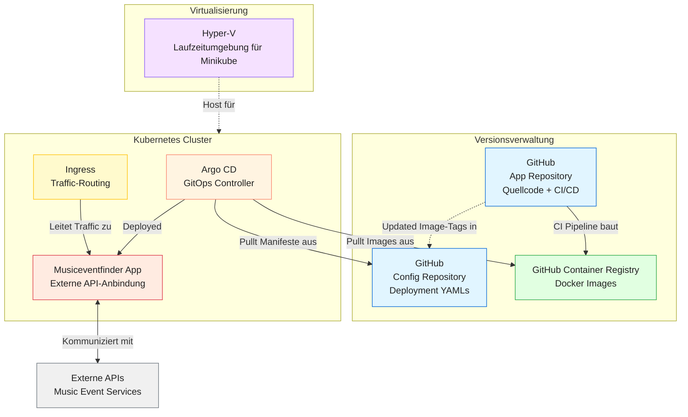

## So funktionierts

### Überblick

Der Microservice Musiceventfinder ist in Flask (Python) implementiert und wird als Docker-Image in der GitHub Container Registry verwaltet. Die Anwendung wird über Argo CD in einem Kubernetes-Cluster (Minikube) deployed. Externe Music-Event-APIs liefern die Eventdaten. Für die lokale Entwicklung wird eine Hyper-V-Umgebung genutzt, während CI/CD-Pipelines die automatische Bereitstellung und Aktualisierung des Images sicherstellen.

### Komponenten im Detail

1. Backend (Flask + Python)
   
  - Implementiert eine REST-API zur:
    - Abfrage und Anzeige von Musik-Events über externe APIs.
    - Verwaltung von Favoriten oder Nutzerinteraktionen (CRUD).
  - Verarbeitet die API-Daten und stellt sie den Nutzern bereit.

2. Docker-Image (GitHub Container Registry)

  - Das fertige Image wird in GitHub abgelegt.
  - Enthält die gesamte Laufzeitumgebung der Flask-App.
  - Argo CD zieht dieses Image und deployed es in das Kubernetes-Cluster.

3. Kubernetes Cluster (Minikube)

  - Orchestriert die Container und sorgt für Skalierbarkeit sowie Ausfallsicherheit.
  - Argo CD überwacht die Manifeste im Config Repository und sorgt für ein automatisches Deployment der neuesten Images.
  - Ingress routet den Benutzer-Traffic zur Musiceventfinder App.

4. Externe Music-Event-APIs

  - Liefern aktuelle Veranstaltungsinformationen.
  - Das Backend ruft diese Daten ab, verarbeitet sie und stellt sie für die Endnutzer bereit.

5. Versionsverwaltung & CI/CD (GitHub)

  - App Repository enthält Quellcode und CI-Pipeline.
  - Config Repository enthält Deployment-Manifeste für Argo CD.
  - CI-Pipeline baut das Docker-Image und speichert es in der GitHub Container Registry.
  - Argo CD übernimmt anschließend das Deployment des fertigen Images.

6. Virtualisierung (Hyper-V)

  - Lokale Entwicklungsumgebung für Minikube.
  - Ermöglicht Tests des Kubernetes-Clusters vor Cloud-Deployments.

#### Zusammenspiel der Komponenten

- Entwickler pushen Code in das App Repository auf GitHub.
- CI/CD-Pipeline baut ein Docker-Image und legt es in der GitHub Container Registry ab.
- Argo CD überwacht das Config Repository, erkennt neue Image-Tags und deployed die aktualisierte Version in das Kubernetes-Cluster
- Ingress leitet den Benutzer-Traffic zur Musiceventfinder App.
- Die App ruft Eventdaten von externen APIs ab, verarbeitet sie und stellt sie den Nutzern bereit.
- Änderungen am Code führen so automatisch zu einem neuen Deployment der aktuellen Version.

## Entwicklung

### Hilfreiche Kommandos:

Löschen des Clusters falls nötig:
`minikube delete -p=c1`

Namespace wechseln:
`kubectl config set-context --current --namespace=<name>`

In ArgoCD meine Applikation automatisch hinterlegen:
  
`kubectl apply -f Minikube-Config/argocd/application.yaml -n argocd`

### Umsetzung

Treiber setzten:
`minikube config set driver docker`

Cluster starten:
`minikube start -p c1`

Profile kontrolle:
`minikube profile list`

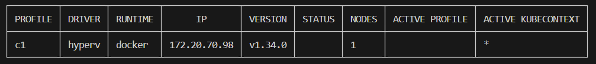

Pods anschauen:
`kubectl get pods -A`

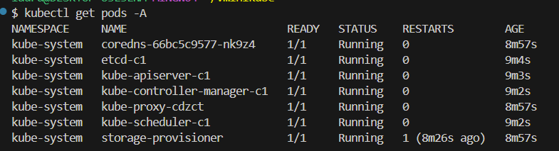

Ingress Addon aktivieren:
`minikube addons enable ingress -p c1`

Musicfinder Namespace erstellen:
`kubectl create namespace musicevents`

Argocd:
```bash
kubectl create namespace argocd
kubectl apply -n argocd -f https://raw.githubusercontent.com/argoproj/argo-cd/stable/manifests/install.yaml
```
Passwort ausgeben lassen für ArgoCD:
`sudo kubectl -n argocd get secret argocd-initial-admin-secret -o jsonpath="{.data.password}" | base64 -d`

Port foward um auf ArgoCD zuzugreiffen:
`kubectl -n argocd port-forward svc/argocd-server 8080:443`

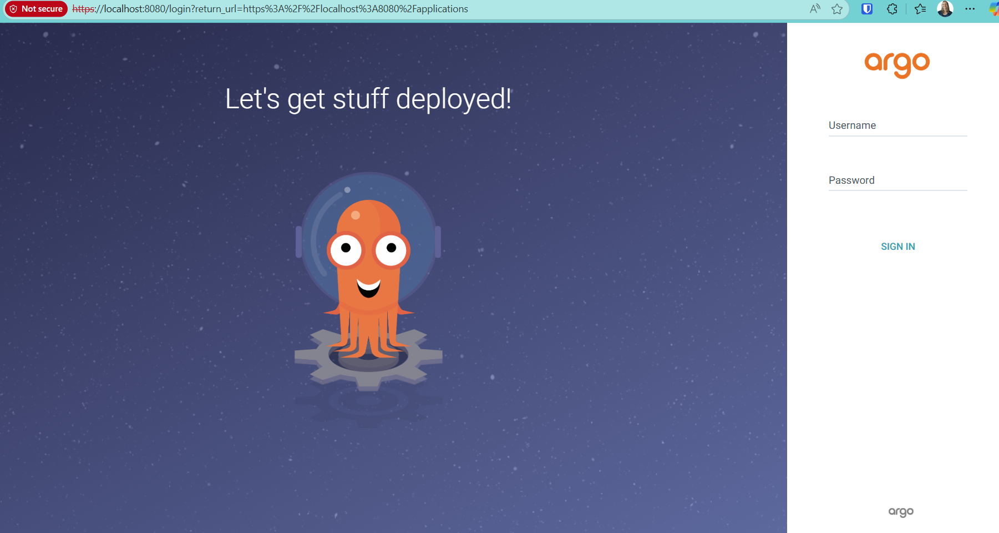

#### In Argocd alles einrichten:

Access auf das Image gewährleisten:

Token im Github erstellen, es ist wichtig das dieser folgende Rechte bekommt:

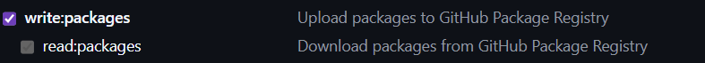

Token erstellen und hinterlegen:

```
kubectl create secret docker-registry ghcr-secret \
  --docker-server=ghcr.io \
  --docker-username=<GITHUB_USERNAME> \
  --docker-password=<PERSONAL_ACCESS_TOKEN> \
  --docker-email=<EMAIL> \
  --namespace default \
  --dry-run=client -o yaml > ghcr-secret.yaml
```

Auf Kubernetes Deployen:

`kubectl apply -f ghcr-secret.yaml`

Tunnel starten um auf Applikation zuzugreiffen:

`minikube tunnel -p c1`

Im Argocd Projekt erstellen und Syncen:

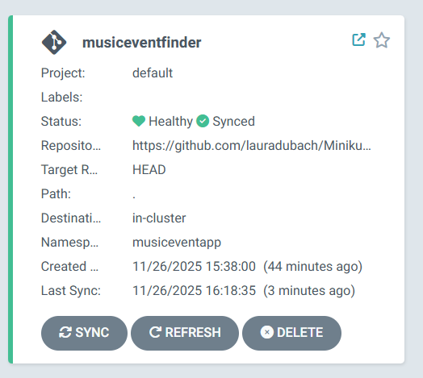

Alle Informationen:

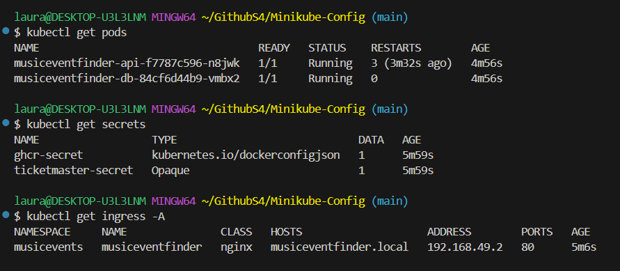

Secrets:

Wichtig mit Base64 Encrypten: `echo "deinSecretWert" | base64`

Ticketmaster API:
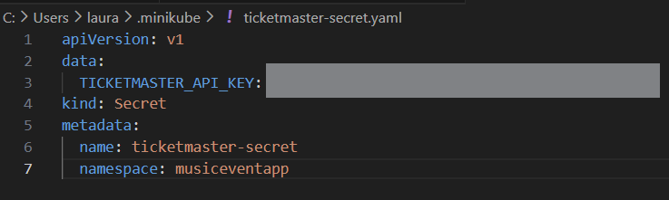

Image Zugang:
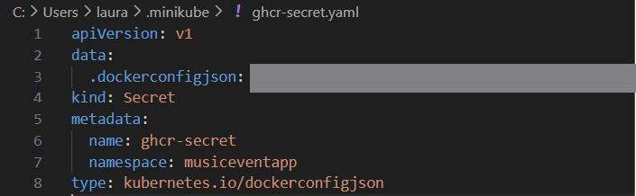

DNS im Hostfile eintragen:

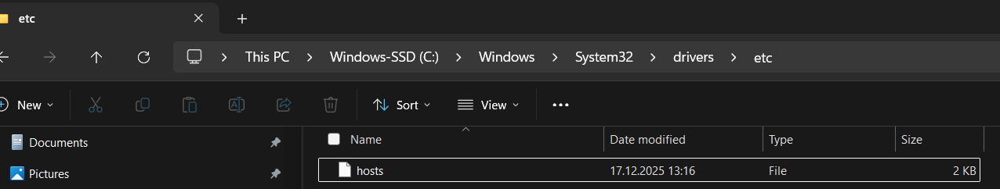

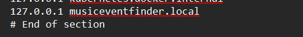

### Automatisieren

Da ich mehrere Male den Cluster neu mache musste, habe ich mich dazu entschieden ein Skript zu schreiben, dass alles automatisch macht bis auf das Port forwarding und den Minikube Tunnel zu starten.

Das Skript liegt hier:

> [Setup Minikube-Docker](https://github.com/lauradubach/Minikube-Config/blob/main/setup-minikube-docker.sh)

Nun muss ich nur noch das File ausführen und dann Port forwarding für ArgoCD und den Tunnel starten für die App:

`kubectl -n argocd port-forward svc/argocd-server 8080:443`
`minikube tunnel -p c1`

## Aufgetretene Probleme

Bei den Secrets hatte ich einige probleme.

Zuerst hatte ich vergessen die Keys auf den Cluster zu pushen, mit `kubectl apply -f xxxx.yaml`

Danach war das Problem, dass er etwas im File nicht lesen konnte:

Error: `grpc: error while marshaling: string field contains invalid UTF-8`

Mir ist dann aufgefallen, dass ich den Ticketmaster Key nicht mit Base64 encryptet habe.

Das habe ich dann wie folgt gemacht: `echo "deinSecretWert" | base64`

Danach hat alles geklappt.

## Probleme beim wiederstarten vom Cluster

Ich wollte nach einer Woche den Cluster wieder starten, um alles zu dokumentieren, dann kam aber immer folgender Error:

`minikube start -p c1`


Das ist nun schon zwei mal vorgekommen.

## Wechsel von Hyper-V zu Docker als Minikube-Driver

Während der Arbeit mit dem Kubernetes-Cluster auf Basis von Minikube mit dem Hyper-V-Driver traten wiederholt Probleme beim Neustart des Clusters auf. Konkret zeigte der Status, dass der API-Server nicht mehr korrekt startete, obwohl Control Plane und Kubelet als „Running“ markiert waren:

```bash
c1
type: Control Plane
host: Running
kubelet: Running
apiserver: Stopped
kubeconfig: Configured
```

Da der API-Server eine zentrale Komponente von Kubernetes ist, war der Cluster in diesem Zustand nicht mehr funktionsfähig. Sämtliche `kubectl`-Operationen schlugen fehl, wodurch weder Deployments noch Debugging möglich waren.

Ein Versuch, den Cluster durch Stoppen und erneutes Starten wiederherzustellen, führte nicht zum gewünschten Ergebnis:

```bash
minikube stop -p c1
minikube start -p c1 --force
```

Zwar ließ sich der Cluster erneut starten, jedoch wurde dabei die bestehende Cluster-Konfiguration überschrieben. Dies hatte zur Folge, dass bereits eingerichtete Komponenten wie Namespaces, Secrets, Ingress-Konfigurationen und ArgoCD-Setups erneut manuell konfiguriert werden mussten. Für eine Projektarbeit mit wiederholten Neustarts und Tests stellt dieses Verhalten ein erhebliches Risiko dar.

Nach Analyse der Situation fiel die Entscheidung, von Hyper-V auf den Docker-Driver zu wechseln. Der Docker-Driver bietet eine stabilere Integration in die bestehende Entwicklungsumgebung, da keine zusätzliche Virtualisierungsschicht notwendig ist und bekannte Probleme mit Hyper-V vermieden werden.

Zusätzlich ermöglicht Docker:

- eine zuverlässigere Persistenz der Cluster-Konfiguration
- schnellere Start- und Stoppzeiten des Clusters
- eine bessere Reproduzierbarkeit der Umgebung
- eine einfachere Fehlersuche bei Problemen

Aus diesen Gründen wurde der Docker-Driver als technisch sinnvollere und robustere Lösung für die Umsetzung dieser Projektarbeit gewählt.

## Fallbacksolution

Da das Projekt nicht für den Produktiven Gebrauch gedacht ist, weil es sich auf einem Learner LAB befindet, benötigt es keine Fallbacksolution. Falls etwas nicht klappt, kann das ganze einfach heruntergefahren werden und wieder auf der lokalen Umgebung bearbeitet werden.

# Kontrollieren

## Testing
### Testkonzept

| Testperson | Datum |
| ---------- | ----- |

| System | Testmittel | Testmethode |
| -------| ---------- | ----------- |

### Testdurchführung

| Testfall | Erwartetes Ergebnis | Testresultat |
| ---------| ------------------- | ------------ |


#### Umgebung:

> Back [Page](https://lauradubach.github.io/Semesterarbeit4/Sites/Teil%202%20Konzeption.html)
>
> Next [Page](https://lauradubach.github.io/Semesterarbeit4/Sites/Teil%204%20Abschluss.html)