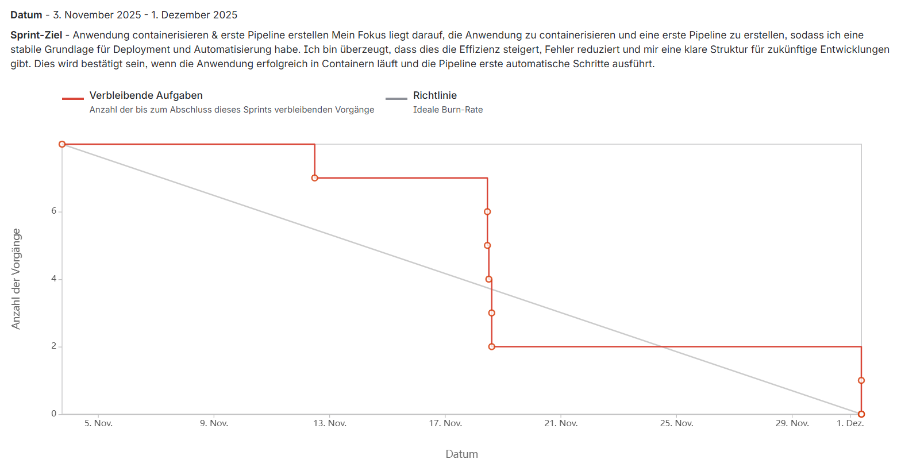
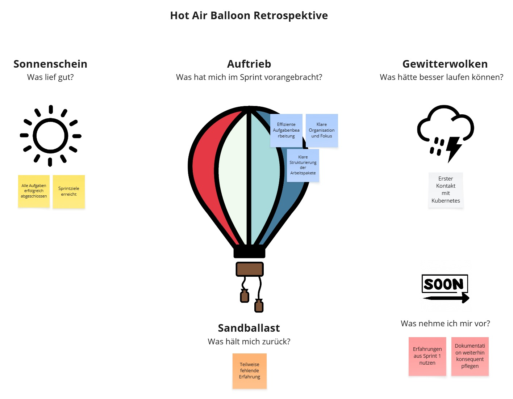
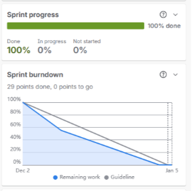
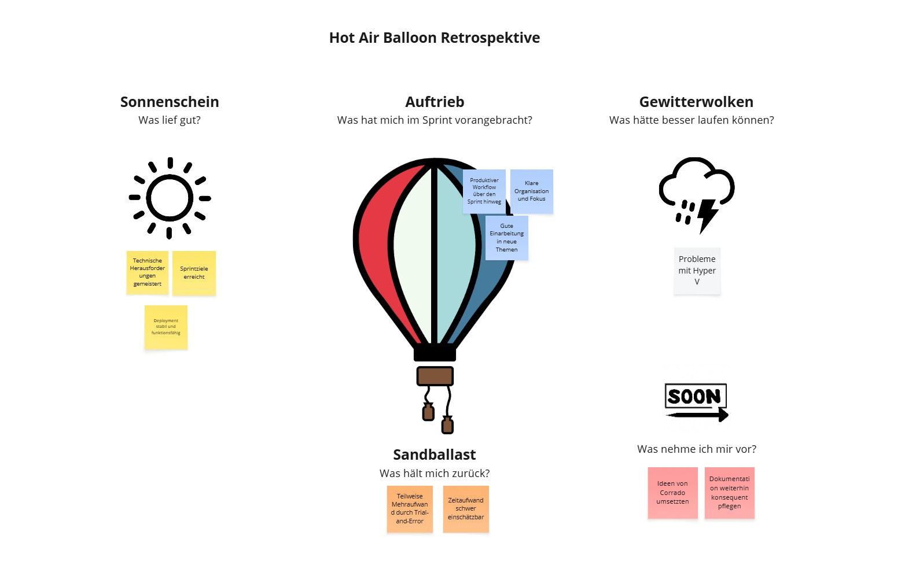

# Sprint Abschlüsse

- [Sprint Abschlüsse](#sprint-abschlüsse)
  - [Sprint Review 1](#sprint-review-1)
    - [Abgeschlossene Story\`s](#abgeschlossene-storys)
  - [Burndownchart](#burndownchart)
  - [Sprint-Retrospektive 1](#sprint-retrospektive-1)
    - [Sonnenschein](#sonnenschein)
    - [Auftrieb](#auftrieb)
    - [Gewitterwolken](#gewitterwolken)
    - [Sandbalast](#sandbalast)
    - [Ausblick](#ausblick)
  - [Sprint Review 2](#sprint-review-2)
    - [Abgeschlossene Story\`s](#abgeschlossene-storys-1)
  - [Burndownchart](#burndownchart-1)
  - [Sprint-Retrospektive 2](#sprint-retrospektive-2)
    - [Sonnenschein](#sonnenschein-1)
    - [Auftrieb](#auftrieb-1)
    - [Gewitterwolken](#gewitterwolken-1)
    - [Sandballast](#sandballast)
    - [Ausblick](#ausblick-1)
  - [Sprint Review 3](#sprint-review-3)
    - [Abgeschlossene Story\`s](#abgeschlossene-storys-2)
  - [Sprint-Retrospektive 3](#sprint-retrospektive-3)
    - [Sonnenschein](#sonnenschein-2)
    - [Auftrieb](#auftrieb-2)
    - [Gewitterwolken](#gewitterwolken-2)
    - [Sandballast](#sandballast-1)
    - [Ausblick](#ausblick-2)
- [Besprechung](#besprechung)

## Sprint Review 1

### Abgeschlossene Story`s

Alle vorgesehenen Story`s konnten fristgerecht abgeschlossen werden.

Folgendes wurde genau umgesetzt:

- Seusag
  - Systemgrenzen sind Dokumentiert.
  - SEUSAG Grafik ist vorhanden.
- Ist und Soll Analyse
  - Ist-Zustand dokumentiert.
  - Soll-Zustand definiert.
  - Grafik erstellt.
- Tools auswählen
  - Liste mit evaluierten Tools liegt vor.
  - Entscheidungskriterien sind dokumentiert.
  - Ausgewählte Tools sind einsatzbereit.
- Entscheidungsmatrix
  - Kriterien sind transparent und gewichtet.
  - Technologien wurden objektiv verglichen.
  - Die Entscheidung ist begründet 
- Implementierungsplan
  - Aufgabenpakete logisch gegliedert.
  - Grafik erstellt.
- Risikomatrix
  - Risiken nach Wahrscheinlichkeit und Auswirkung bewertet.
  - Risikomatrix als übersichtliche Grafik erstellt.
  - Risikokategorien klar benannt und dokumentiert.
  - Maßnahmen zur Risikominimierung vorgeschlagen.
- Container lokal bauen und testen
  - Dockerfile ist erstellt und enthält alle notwendigen Abhängigkeiten.
  - Container kann lokal erfolgreich gebaut werden.
  - Anwendung startet im Container und ist über einen definierten Port erreichbar.
  - Funktionstest bestätigt, dass die Kernfunktionen im Container funktionieren.
  - Testergebnisse sind dokumentiert.
- Basis-CI/CD-Pipeline aufsetzen (Build + Test)
  - Pipeline-Definition ist erstellt und versioniert.
  - Bei jedem Commit wird automatisch ein Build-Prozess gestartet.
  - Automatisierte Tests werden in der Pipeline ausgeführt.
  - Pipeline-Status wird im Repository sichtbar angezeigt.
  - Fehlgeschlagene Builds oder Tests werden mit klaren Fehlermeldungen angezeigt.

Siehe Teil Konzeption: 

- > [Teil 2](https://lauradubach.github.io/Semesterarbeit4/Sites/Teil%202%20Konzeption.html) Konzeption

## Burndownchart

Da ich Fibonacci erst später angewendet habe, ist das Burndownchart mit den Storypoints falsch. Deshalb habe ich hier das Chart hinterlegt mit den "Anzahl Vorgängen"

## Sprint-Retrospektive 1

### Sonnenschein

- Alle Aufgaben erfolgreich abgeschlossen
- Sprintziele erreicht

### Auftrieb

- Effiziente Aufgabenbearbeitung
- Klare Organisation und Fokus
- Klare Strukturierung der Arbeitspakete

### Gewitterwolken

- Erster Kontakt mit Kubernetes

### Sandbalast

- Teilweise fehlende Erfahrung

### Ausblick

- Erfahrungen aus Sprint 1 nutzen
- Dokumentation weiterhin konsequent pflegen

## Sprint Review 2

### Abgeschlossene Story`s

Alle vorgesehenen Story`s konnten fristgerecht abgeschlossen werden.

Folgendes wurde genau umgesetzt:

- Kubernetes-Manifeste oder Helm-Charts erstellen
  - Deployment-, Service- und ggf. ConfigMap-/Secret-Manifeste sind erstellt.
  - Alle YAML-Dateien sind validiert und im Repository versioniert.
  - Ressourcen können mit kubectl apply oder helm install ohne Fehler deployt werden.
  - Dokumentation zur Nutzung und Anpassung der Manifeste ist vorhanden.

- Service, Ingress & Deployment konfigurieren
  - Deployment-Objekt ist korrekt definiert (Image, Replikas, Ressourcenlimits, etc.).
  - Service stellt den Microservice intern bereit.
  - Ingress ist eingerichtet und ermöglicht externen Zugriff über einen definierten Endpunkt.
  - Zugriff auf den Microservice über den angegebenen Host oder Port ist erfolgreich.
  - Änderungen an Konfigurationen können ohne Ausfall neu ausgerollt werden.

- CI/CD um Deployment-Stufe erweitern
  - Deployment-Schritt ist in die Pipeline integriert
  - Deployment erfolgt nur, wenn Build und Tests erfolgreich sind.
  - Pipeline führt automatisch kubectl apply oder helm upgrade aus.
  - Erfolgreiches Deployment wird in der Pipeline angezeigt.
  - Bei Fehlern wird das Deployment abgebrochen und der vorherige Zustand beibehalten.

Folgender Punkt wurde während dem Sprint ergänzt:

Kein Punkt wurde ergänzt, der Sprint ging jedoch eine Woche länger also 5 Wochen, da noch eine Woche Ferien eingeplant sind und da nicht gearbeitet wurde.

Siehe Teil Realisierung: 

- > [Teil 3](https://lauradubach.github.io/Semesterarbeit4/Sites/Teil%203%20Realisierung.html) Realisierung

## Burndownchart

## Sprint-Retrospektive 2

### Sonnenschein

- Technische Herausforderungen gemeistert
- Deployment stabil und funktionsfähig
- Sprintziele erreicht  

### Auftrieb

- Gute Einarbeitung in neue Themen
- Produktiver Workflow über den Sprint hinweg
- Klare Organisation und Fokus

### Gewitterwolken

- Probleme mit Hyper V

### Sandballast

- Teilweise Mehraufwand durch Trial-and-Error
- Zeitaufwand schwer einschätzbar

### Ausblick

- Ideen von Corrado umsetzten
- Dokumentation weiterhin konsequent pflegen

## Sprint Review 3

### Abgeschlossene Story`s

Alle vorgesehenen Story`s konnten fristgerecht abgeschlossen werden.

Folgendes wurde genau umgesetzt:

- Feinschliff & Erweiterung
  - Verbesserungen dokumentiert und getestet.
  - Erweiterungen beeinträchtigen keine Kernfunktionalität.
  - Projektstand ist stabil.
- Stabilisierung & Tests
  - Tests laufen erfolgreich.
  - Keine kritischen Bugs vorhanden.
  - Anwendung ist testbereit.
- Abschluss-Review, Reflexion & Retrospektive
  - Sprint- und Projektziele wurden überprüft und bewertet.
  - Erkenntnisse, Herausforderungen und Erfolge sind dokumentiert.
  - Verbesserungsmöglichkeiten für zukünftige Projekte sind festgehalten.
  - Feedback vom Betreuer oder Team wurde eingeholt und reflektiert.
  - Retrospektive wurde protokolliert.
- Projektdokumentation finalisieren
  - Dokumentation umfasst Architektur, CI/CD-Pipeline, Kubernetes-Setup und Scrum-Prozess.
  - Alle User Stories, Sprints und Ergebnisse sind beschrieben.
  - Screenshots oder Diagramme sind enthalten.
  - Dokumentation liegt in strukturierter Form vor.
- Präsentation vorbereiten
  - Präsentation ist vollständig.
  - Mindestens ein Probedurchlauf erfolgt.
  - Zeitrahmen wird eingehalten.
- Abgabe Arbeit
  - Abgabe erfolgt spätestens am 28.01.
  - Bestätigung der Einreichung vorhanden.
  - Alles ist final und unverändert.

## Sprint-Retrospektive 3

### Sonnenschein

### Auftrieb

### Gewitterwolken

### Sandballast

### Ausblick

# Besprechung

| Besprechung | Datum | Uhrzeit | Teilnehmer | 
| ---- | ---- | ---- | ---- |
| 1 | 13.06.2025 | 18:30 | Corrado Parisi, Laura Dubach |

Wir hatten ein Gespräch über Teams. Ich hatte nur die Frage ob ich die Burndowncharts korrekt hinterlegt habe. Da ich gewisse Fibonacci punkte erst im nachhinein hinterlegt habe, waren die Charts nicht immer richtig. Deshalb habe ich die "Anzahl Vorgängen" hinterlegt beim ersten Sprint Abschluss.

Er meinte das sei völlig plausiebel und sieht dem Brundownchart sehr ähndlich.

Das Gespräch verlief gut. All meine Fragen konnten beantwortet werden und Corrado gab mir gute Tipps. Nun kann ich weiterarbeiten.

