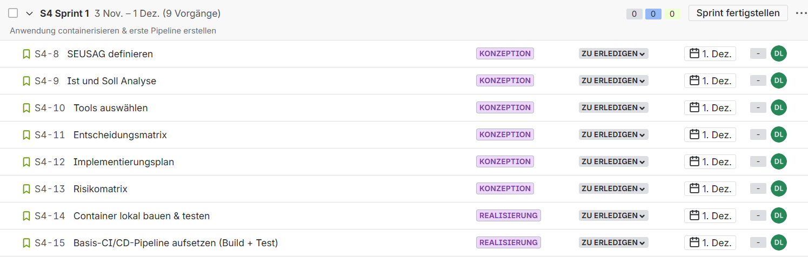
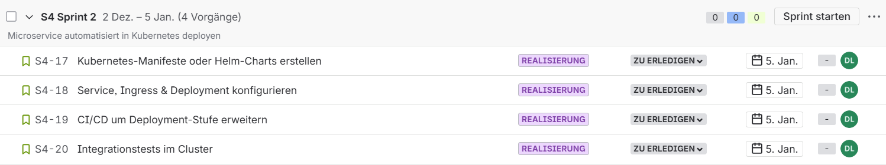
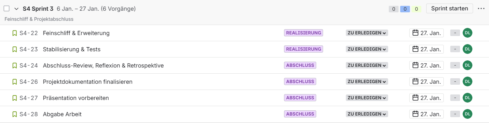

# Sprint Planning

**Zeitraum:** 27.10.2025 - 28.01.2026
**Methode:** SCRUM  
**Anzahl Sprints:** 3 Sprints und einen Sprint 0 für die Vorbereitung 

- [Sprint Planning](#sprint-planning)
  - [Sprint 1, 03.11.25 - 01.12.25, 28 Tage](#sprint-1-031125---011225-28-tage)
    - [Aufgaben](#aufgaben)
    - [Aufgabenverteilung](#aufgabenverteilung)
    - [Nächste Schritte](#nächste-schritte)
  - [Sprint 2, 02.12.25 - 05.01.26, 34 Tage](#sprint-2-021225---050126-34-tage)
    - [Aufgaben](#aufgaben-1)
    - [Aufgabenverteilung](#aufgabenverteilung-1)
    - [Nächste Schritte](#nächste-schritte-1)
  - [Sprint 3, 06.01.26 - 27.01.26, 21 Tage](#sprint-3-060126---270126-21-tage)
    - [Aufgaben](#aufgaben-2)
    - [Aufgabenverteilung](#aufgabenverteilung-2)
    - [Nächste Schritte](#nächste-schritte-2)

## Sprint 1, 03.11.25 - 01.12.25, 28 Tage

> Sprint Ziel: Anwendung containerisieren & erste Pipeline erstellen

- Mein Fokus liegt darauf, die Anwendung zu containerisieren und eine erste Pipeline zu erstellen, sodass ich eine stabile Grundlage für Deployment und Automatisierung habe.
- Ich bin überzeugt, dass dies die Effizienz steigert, Fehler reduziert und mir eine klare Struktur für zukünftige Entwicklungen gibt.
- Dies wird bestätigt sein, wenn die Anwendung erfolgreich in Containern läuft und die Pipeline erste automatische Schritte ausführt.

### Aufgaben

### Aufgabenverteilung

Alle Aufgaben werden von Laura Dubach umgesetzt.

### Nächste Schritte

- Sprintreview findet am: 02.12.25  statt

## Sprint 2, 02.12.25 - 05.01.26, 34 Tage

> Sprint Ziel: Microservice automatisiert in Kubernetes deployen

- Mein Fokus liegt darauf, den Microservice automatisiert in Kubernetes zu deployen, sodass ich den Betrieb skalierbar und zuverlässig gestalten kann.
- Ich bin überzeugt, dass dies die Effizienz erhöht, manuelle Fehler reduziert und eine stabile Grundlage für weitere Microservices schafft.
- Dies wird bestätigt sein, wenn der Microservice automatisch in Kubernetes bereitgestellt wird und korrekt läuft.

### Aufgaben

### Aufgabenverteilung

Alle Aufgaben werden von Laura Dubach umgesetzt.

### Nächste Schritte

- Sprintreview findet am: 06.01.26 statt

## Sprint 3, 06.01.26 - 27.01.26, 21 Tage

> Sprint Ziel: Feinschliff & Projektabschluss

- Mein Fokus liegt darauf, den Feinschliff am Projekt vorzunehmen und es erfolgreich abzuschließen, sodass alle Ergebnisse sauber, vollständig und funktionsfähig sind.
- Ich bin überzeugt, dass dies die Qualität sicherstellt, offene Aufgaben abschließt und eine klare Übergabe oder Präsentation ermöglicht.
- Dies wird bestätigt sein, wenn alle geplanten Features umgesetzt, getestet und dokumentiert sind und das Projekt einsatzbereit ist.

### Aufgaben

### Aufgabenverteilung

Alle Aufgaben werden von Laura Dubach umgesetzt.

### Nächste Schritte

- Sprintreview findet am: 27.01.26 statt